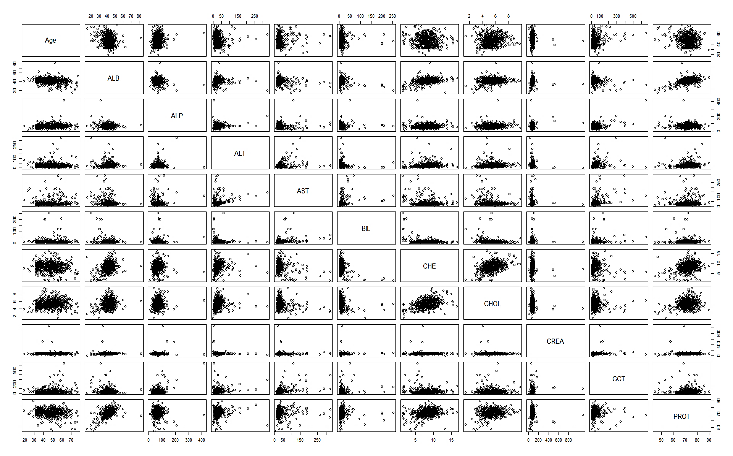
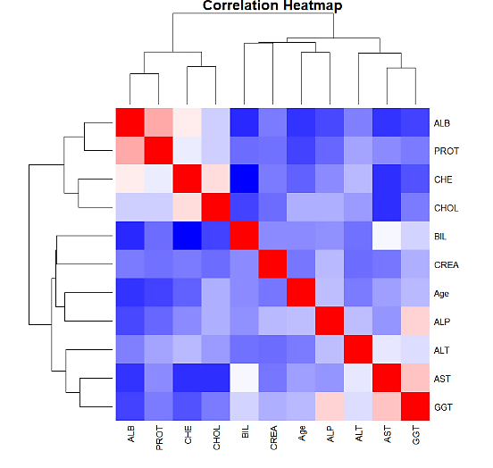
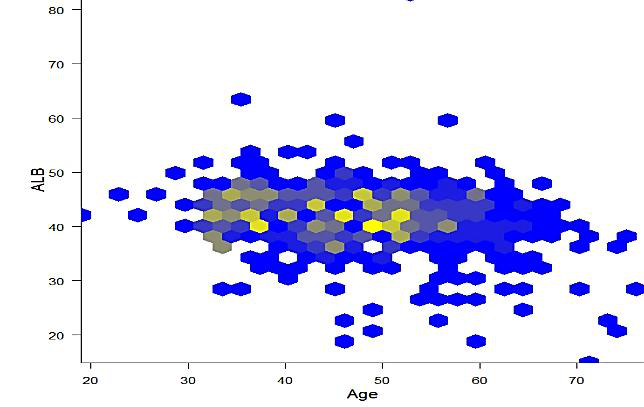
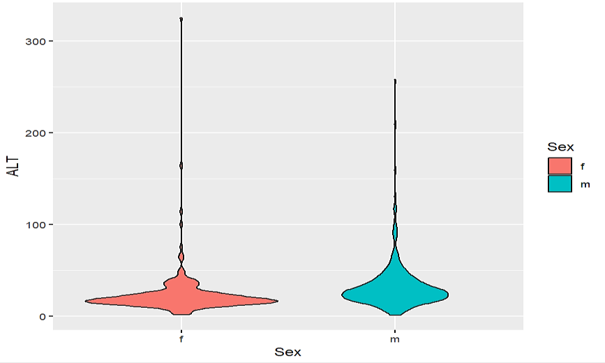
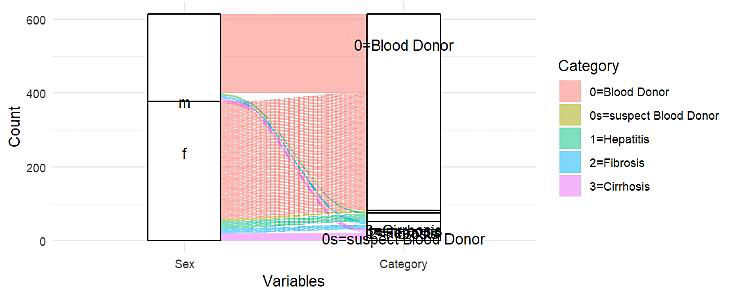
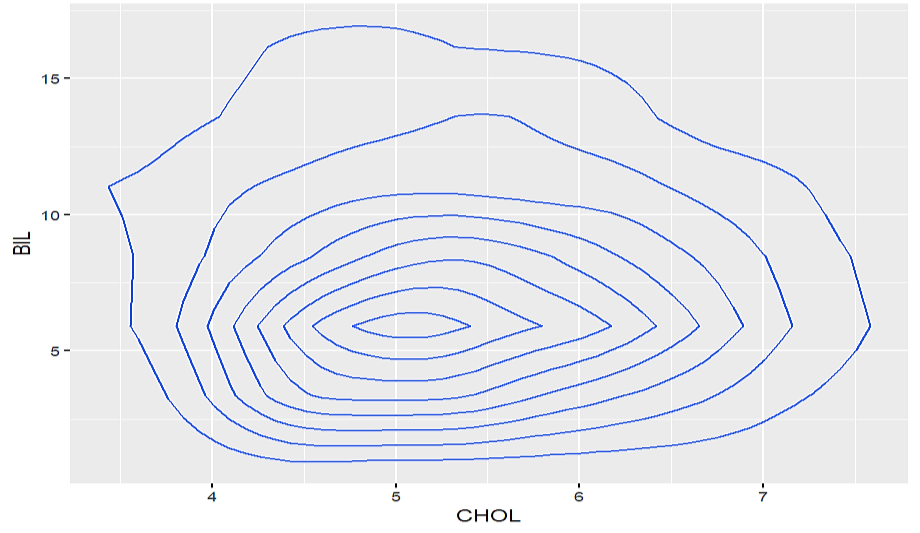

# Advanced Visualization Approaches for Statistical Data Analysis

[](https://doi.org/10.22105/metaverse.v1i1.36)
[](https://www.meta.reapress.com/journal/article/view/36)
[](https://www.r-project.org/)

Companion code for the paper:

> **Advanced Visualization Approaches for Statistical Data Analysis**
> Md Wahiduzzaman Suva, Md. Imtiaj Alam Sajin, Esm E Moula Chowdhury Abha, Mushfiqur Rahman Abir, and Asif Zaman
> *Metaversalize* 1(4), 225-239, 2024. [Read the paper](https://doi.org/10.22105/metaverse.v1i1.36)

This project demonstrates 20+ visualization techniques in R, from exploratory plots to advanced multivariate graphics, applied to the [UCI HCV dataset](https://archive.ics.uci.edu/dataset/571/hcv+data) of clinical lab measurements.

## Gallery

| | |
|:---:|:---:|
|  |  |
| Pairwise scatter-plot matrix | Clustered correlation heatmap |
|  |  |
| Hexagonal binning, Age vs. ALB | Violin plot of ALT by sex |
|  |  |
| Alluvial flow, sex to diagnosis | Bilirubin vs. cholesterol contours |

## Contents

| File | Description |
|---|---|
| [`visualization-techniques.R`](visualization-techniques.R) | The paper's visualization suite on the HCV dataset |
| [`hepatitis-preprocessing.R`](hepatitis-preprocessing.R) | Preprocessing and imputation on the UCI Hepatitis dataset |
| [`figures/`](figures/) | Figures from the paper |

## Running

```r
install.packages(c("dplyr", "ggplot2", "hexbin", "corrplot", "plotly",
                   "GGally", "ggalluvial", "ggridges"))
```

Download the [HCV data](https://archive.ics.uci.edu/dataset/571/hcv+data) and save it as `hcv_data.csv` beside the scripts, then run `visualization-techniques.R`. For `hepatitis-preprocessing.R`, save the [Hepatitis data](https://archive.ics.uci.edu/dataset/46/hepatitis) as `hepatitis_data.csv`.

## Citation

```bibtex
@article{suva2024advanced,
  title   = {Advanced visualization approaches for statistical data analysis},
  author  = {Suva, Md Wahiduzzaman and Sajin, Md Imtiaj Alam and Abha, Esm E Moula Chowdhury and Abir, Mushfiqur Rahman and Zaman, Asif},
  journal = {Metaversalize},
  volume  = {1},
  number  = {4},
  pages   = {225--239},
  year    = {2024},
  doi     = {10.22105/metaverse.v1i1.36}
}
```
